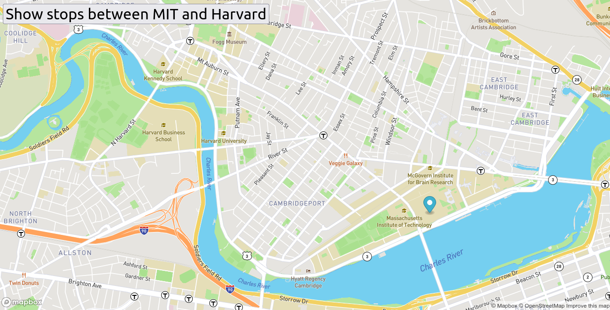

# Real_Time_Bus_Tracker_Boston
Bus stations from MIt to Harvard

## Real Time Bus Tracker

**Project description:**

Performs an animated tracking of the route of the main bus stops in real time from MIT to Harvard university located in Boston, Massachusetts. 

**How it is executed:**
To run the index.html file in any empty tab of your web server Firefox, Chrome, etc and click where it says "Show stops between MIT and Harvard" and you will see the trajectory of the bus stops between those two points.

**Roadmap of Future Improvments:**
It can be improved by setting stop times for each bus line, service hours, ticket sales, drivers' names.

**License Information** 
MIT License.
